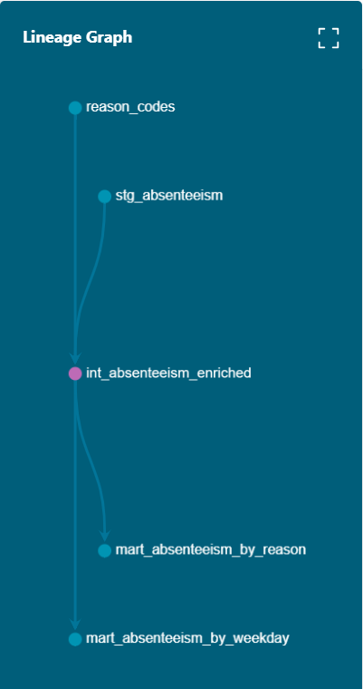

# Análise de Absenteísmo — Pipeline de Engenharia de Dados

Projeto de portfólio que constrói um pipeline completo de dados sobre absenteísmo no trabalho, combinando engenharia de dados, modelagem analítica e governança de qualidade.

## Objetivo

Transformar dados brutos de ausências no trabalho em métricas confiáveis e testadas, aplicando princípios de rotina de gestão e melhoria contínua (PDCA) à própria arquitetura de dados.

## Stack

- **Postgres** — banco de dados (rodando via Docker)
- **dbt** — transformação, testes de qualidade e documentação
- **Python (pandas, sqlalchemy)** — carga inicial do dado bruto
- **Docker** — ambiente containerizado
- **Airflow** — orquestração do pipeline (via Docker Compose)

## Fonte dos dados

Dataset público ["Absenteeism at Work"](https://archive.ics.uci.edu/dataset/445/absenteeism+at+work), UCI Machine Learning Repository — dataset coletado em uma empresa de courier no Brasil entre 2007 e 2010, com 740 registros de ausências, incluindo motivo (classificado por CID), dia da semana, distância até o trabalho, carga de dependentes, entre outras variáveis.

## Arquitetura

O projeto segue uma arquitetura em camadas dentro do dbt:

- **staging** — limpeza e padronização do dado bruto (renomeação de colunas, tratamento de nomes com espaços/inconsistências do CSV original)
- **seed** — tabela de-para dos motivos de ausência (`reason_codes.csv`), construída manualmente a partir da classificação CID, já que o dataset original só traz códigos numéricos
- **intermediate** — enriquecimento: junta staging e seed, traduz códigos de dia da semana
- **marts** — métricas finais de negócio: absenteísmo por dia da semana e por motivo

## Qualidade de dados

7 testes automatizados no dbt cobrindo:
- Valores nulos em colunas críticas (`not_null`)
- Valores aceitos dentro de listas válidas (`accepted_values`)
- Faixas plausíveis para variáveis numéricas (`accepted_range`, via `dbt_utils`)

Todos os testes passam atualmente, confirmando a integridade do dado nessas dimensões.

## Metodologia da análise exploratória

Conduzi a análise exploratória em camadas de complexidade crescente, sempre puxando dados já modelados via dbt (camadas `intermediate` e `marts`) para o Python via pandas/sqlalchemy. Utilizei apoio de IA generativa (Claude, Anthropic) para acelerar a exploração de hipóteses e a escrita de scripts — a definição de quais perguntas investigar, a interpretação dos resultados e a validação de cada achado foram feitas por mim.

**Estatística descritiva (contagens e médias)**
Para cada recorte (dia da semana, motivo, estação, faixa etária, etc.), calculei três métricas: soma total de horas, contagem de ocorrências e média de horas por ocorrência. Priorizei a média por ocorrência nas comparações entre grupos de tamanhos diferentes, para não confundir "grupo maior" com "grupo mais afetado".

**Análise de Pareto**
Ordenei os motivos (e depois os funcionários) do maior para o menor volume de horas, calculando o percentual acumulado até atingir 80% do total — método clássico para identificar onde a maior alavancagem de ação está concentrada.

**Matriz de correlação**
Usei o coeficiente de correlação de Pearson (`pandas.DataFrame.corr()`) para medir a força e direção de relações lineares entre pares de variáveis numéricas (idade, distância, BMI, horas de ausência, etc.). Valores próximos de 0 indicam ausência de relação linear; próximos de ±1, relação forte. Importante: correlação não captura relações não-lineares nem implica causalidade.

**Regressão linear múltipla (OLS)**
Para testar se os efeitos observados nas análises univariadas se mantinham significativos quando várias variáveis eram controladas simultaneamente, rodei uma regressão por Mínimos Quadrados Ordinários (`statsmodels.OLS`), restrita aos dois motivos de maior impacto (doenças osteomusculares e lesões/causas externas). Interpretação dos principais indicadores do modelo:
- **R² / R² ajustado**: percentual da variação total explicado pelo modelo (ajustado penaliza excesso de variáveis)
- **p-valor de cada coeficiente**: probabilidade de o efeito observado ser fruto do acaso; adotei o limiar convencional de 0,05
- **Coeficiente**: quanto a variável de resposta muda, em média, para cada unidade de aumento na variável explicativa, mantendo as demais constantes

**Análise de perfil composto**
Após identificar o grupo de funcionários responsável por 80% das horas nos dois motivos principais, comparei esse grupo com o restante da empresa em múltiplas variáveis simultaneamente (idade, hábito social de bebida, tempo de serviço, escolaridade, BMI, sazonalidade), buscando um padrão combinado que nenhuma variável isolada havia revelado.

## Principais achados

**1. Duas causas concentram quase um terço das horas de ausência**
Doenças do sistema osteomuscular (16,4%) e lesões/causas externas (14,2%) são as duas maiores causas isoladas dentre 28 categorias possíveis — juntas, quase 31% do total.

**2. Diagnóstico médico pesa mais por evento que causas administrativas**
Ausências com diagnóstico médico (CID) somam em média 13,52h por evento, contra 3,63h de eventos administrativos (consultas, exames) — uma razão de quase 4x.

**3. As duas causas principais têm componente sazonal real**
No inverno, osteomuscular + lesões triplicam em horas totais e quase dobram em número de ocorrências frente às demais estações — padrão consistente, não apenas efeito de poucos casos extremos.

**4. O achado mais forte: concentração extrema por funcionário**
Apenas 9 de 36 funcionários (25% do quadro) respondem por 56,4% de todas as horas de ausência da empresa, somando todos os motivos — não apenas as duas causas principais.

**5. Esse grupo tem um perfil demográfico reconhecível**
Comparado ao restante da empresa, o grupo concentrado tem: 89% de bebedores sociais (contra 46% no restante), mais tempo de casa (13,9 vs. 9,5 anos em média), leve tendência a maior idade e BMI, e menor diversidade de escolaridade formal. Curiosamente, esse grupo depende *menos* de sazonalidade de inverno que o restante da empresa — sugerindo um padrão mais crônico/constante, distinto do padrão sazonal-agudo observado na empresa como um todo.

**6. Regressão confirma "bebedor social" como único efeito estatisticamente robusto**
Controlando simultaneamente por idade, distância, meta atingida, gasto com transporte e estação, apenas o hábito social de bebida se manteve estatisticamente significativo (coeficiente de +12,86h, p=0,036). O modelo como um todo explica apenas 13,4% da variação (R²) — sinal de que fatores não capturados no dataset (ex: tipo de função, esforço físico da rotina) provavelmente têm peso maior do que as variáveis demográficas disponíveis.

**7. Achado secundário: bebedores sociais se ausentam proporcionalmente mais às segundas-feiras**
34,3% das horas de ausência de bebedores sociais caem em segundas-feiras, contra 20,2% dos não-bebedores — consistente com a leitura de "efeito pós-fim de semana". Testei também se esse padrão de segunda-feira estava especificamente concentrado no grupo dos 9 funcionários de maior impacto, e **não encontrei essa conexão** (30,7% vs. 27,0% — diferença não relevante) — ou seja, o efeito de segunda-feira parece ligado ao hábito social de bebida de forma mais ampla na empresa, não ao grupo de maior concentração de horas.

## Limitações conhecidas

- O dataset não possui coluna de setor/departamento/cargo, impossibilitando segmentação organizacional
- A categoria "acompanhamento do paciente" não especifica, na documentação original, se refere ao próprio funcionário ou a um dependente
- A amostra do grupo concentrado (9 pessoas) é pequena — achados categóricos como "100% no menor nível de escolaridade" devem ser lidos como indício, não como padrão populacional robusto
- Correlações e regressão capturam relações lineares; efeitos não-lineares (ex: risco que só aparece acima de certa idade) podem estar subestimados

## Como rodar localmente

\`\`\`bash
# 1. Subir o Postgres
docker run -d --name absenteeismo-pg \\
  -e POSTGRES_USER=dbt_user -e POSTGRES_PASSWORD=dbt_pass \\
  -e POSTGRES_DB=absenteeismo -p 5433:5432 postgres:16

# 2. Ambiente Python
python3 -m venv venv && source venv/bin/activate
pip install dbt-postgres pandas sqlalchemy psycopg2-binary

# 3. Carregar o dado bruto
python load_raw.py

# 4. Rodar o dbt
cd absenteismo_dbt
dbt deps
dbt seed
dbt run
dbt test
\`\`\`

> **Nota sobre credenciais:** as credenciais usadas neste projeto (\`dbt_user\`/\`dbt_pass\`) são propositalmente simples por se tratar de um ambiente de estudo local. Em produção, senhas seriam geradas de forma segura e geridas via variáveis de ambiente ou um gerenciador de segredos (ex: AWS Secrets Manager).

## Roadmap

- [x] Modelagem em camadas (staging → intermediate → marts)
- [x] Seed de enriquecimento (motivos de ausência)
- [x] Testes de qualidade de dados
- [x] Orquestração via Airflow
- [x] Análise exploratória em Python (Pareto, correlação, regressão, perfil demográfico)
- [ ] Documentação gerada via \`dbt docs\`

---

Projeto desenvolvido por [Marília Maragno](https://www.linkedin.com/in/mariliamaragno/) como parte de estudo aplicado em engenharia e análise de dados.
